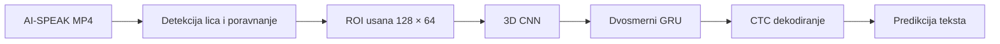

# Serbian Visual Speech Recognition with LipNet

Lip-reading Serbian speech from video only using a
3D CNN + BiGRU + CTC architecture.

**Best test result: 41.20% WER / 14.70% CER**
using prefix beam search with a character-level 5-gram language model.

Ovaj repozitorijum sadrži kompletan eksperimentalni pipeline za vizuelno
prepoznavanje srpskog govora: od izdvajanja regiona usana iz AI-SPEAK snimaka,
preko prilagođavanja i treniranja LipNet modela, do evaluacije tačnosti i
robustnosti. Projekat je realizovan u okviru predmeta **Mašinsko učenje 2**.

Osnova rešenja je [VIPL LipNet implementacija](https://github.com/VIPL-Audio-Visual-Speech-Understanding/LipNet-PyTorch),
prilagođena srpskom skupu karaktera, promenljivim dužinama video-sekvenci i
speaker-disjoint podeli AI-SPEAK korpusa.

## Rezultat rada

Finalni baseline je izabran prema validation WER-u i evaluiran jednom nad 540
test primera govornika koji nisu korišćeni za trening.

Eksperimentalni tok je završen kroz Fazu 08 i dokumentovan u izvršenom
[`08_faza_8_konsolidovani_notebook.ipynb`](playground/08_faza_8_konsolidovani_notebook.ipynb).
Finalni rad dostupan je kao
[`PDF`](report/finalni-izvestaj-lipnet.pdf) i
[`HTML`](report/finalni-izvestaj-lipnet.html), zajedno sa slikama korišćenim u
izveštaju u folderu [`report/assets`](report/README.md#slike).

| Metrika | Validation skup | Test skup |
|---|---:|---:|
| WER | 49,72% | **45,25%** |
| CER | 22,02% | **18,24%** |
| Broj primera | 540 | 540 |

### CTC dekodiranje

Faza 07 je završena nad istim zamrznutim checkpoint-om i test skupom. Parametri
dekodera izabrani su isključivo na validation skupu, dok je test skup evaluiran
jednom nakon zaključavanja konfiguracije.

| Dekoder | Test WER | Test CER | Exact match |
|---|---:|---:|---:|
| Greedy baseline | 45,25% | 18,24% | 0,00% |
| Prefix beam, bez LM-a | 44,88% | 18,10% | 0,00% |
| Prefix beam + 5-gram LM | **41,20%** | **14,70%** | **0,37%** |

Najbolji rezultat koristi prefix beam search širine 50 i karakterni 5-gram
jezički model treniran samo nad 2.877 train transkripata (`α = 1,0`,
`β = 0,5`). U odnosu na greedy baseline, WER je smanjen za 4,04 procentna
poena, a CER za 3,54 procentna poena. Izvršeni notebook je
[`07_faza_7_decoder_search.ipynb`](playground/07_faza_7_decoder_search.ipynb).

### Robustnost ulaza

Eksperimenti robustnosti pokazuju da model zadržava sličan rezultat pri manjoj
rezoluciji, blagom zamućenju i malom pomeranju regiona usana:

| Uslov | WER | Promena WER-a |
|---|---:|---:|
| Baseline, 128 × 64 | **45,25%** | — |
| Rezolucija 96 × 48 | 45,77% | +0,52 p.p. |
| Rezolucija 64 × 32 | 45,90% | +0,65 p.p. |
| Gaussian blur | 45,96% | +0,71 p.p. |
| Pomeranje crop-a | 45,34% | +0,09 p.p. |

Mašinski čitljivi rezultati i tačna konfiguracija eksperimenta nalaze se u
folderu [`docs/results`](docs/results/README.md).

## Kako sistem radi



Model koristi tri 3D konvoluciona bloka za prostorno-vremenske karakteristike,
dva BiGRU sloja za modelovanje sekvence i CTC izlaz nad 29 klasa. Padding se
maskira kroz mrežu, a realne dužine sekvenci koriste se i u BiGRU slojevima i
pri dekodiranju.

## Struktura repozitorijuma

Svaki važan folder ima sopstveni README sa detaljima o sadržaju i načinu
korišćenja.

| Putanja | Sadržaj |
|---|---|
| [`lipnet/`](lipnet/README.md) | model, Dataset adapter, trening, dekoder i evaluacija |
| [`data/`](data/README.md) | verzionisana speaker-disjoint podela skupa |
| [`playground/`](playground/README.md) | reproduktivni Google Colab notebookovi, faze 0–8 |
| [`scripts/`](scripts/README.md) | preprocessing i generator notebookova |
| [`docs/`](docs/README.md) | metodologija, tehničke odluke i potvrđeni rezultati |
| [`tests/`](tests/README.md) | lokalni CPU testovi ključnih ugovora sistema |
| [`report/`](report/README.md) | finalni izveštaj u PDF/HTML formatu i njegove slike |

## Reprodukcija eksperimenta

### 1. Lokalno okruženje

Preporučen je Python 3.12 i [uv](https://docs.astral.sh/uv/).

```powershell
git clone https://github.com/nikolabakic/Vizuelno-prepoznavanje-govora-na-osnovu-pokreta-usana-pomo-u-LipNet-modela.git
cd Vizuelno-prepoznavanje-govora-na-osnovu-pokreta-usana-pomo-u-LipNet-modela
uv sync --frozen --all-groups
uv run pytest -q
```

Lokalni testovi ne zahtevaju GPU niti pristup AI-SPEAK podacima.

### 2. Eksperimentalni pipeline

Notebookove iz foldera [`playground`](playground/README.md) treba pokretati
redosledom od `00` do `08`. Oni pokrivaju:

1. proveru izvornog VIPL modela i GRID inference-a;
2. pripremu AI-SPEAK snimaka i izdvajanje regiona usana;
3. srpski Dataset, vokabular i speaker-disjoint split;
4. transfer VIPL težina i proveru CTC treninga;
5. fine-tuning i izbor najboljeg checkpoint-a;
6. eksperimente robustnosti ulaza;
7. završeno poređenje greedy i prefix beam CTC dekodiranja, bez i sa
   karakternim 5-gram jezičkim modelom;
8. konsolidaciju zaključanih rezultata, obaveznu GPU predikciju, slot-konfuzije
   i figure namenjene finalnom izveštaju.

Notebook 08 ne ponavlja trening ni preprocessing. Izvršen je poslednji na Colab
NVIDIA L4 GPU-u i vraćen u repozitorijum sa outputima. Završna provera u
notebooku potvrđuje zajednički checkpoint, GPU demonstraciju, metrike, bootstrap
intervale i svih sedam generisanih figura.

Notebookovi su generisani skriptom
[`scripts/build_phase_notebooks.py`](scripts/build_phase_notebooks.py). Izmene
se unose u generator, nakon čega se notebookovi ponovo generišu:

```powershell
uv run python scripts/build_phase_notebooks.py
```

## Podaci i artefakti

Veliki podaci, video-snimci, frejmovi usana i checkpoint-i čuvaju se van Git
repozitorijuma. Notebookovi očekuju sledeće podrazumevane Google Drive putanje:

```text
/content/drive/MyDrive/processed.zip
/content/drive/MyDrive/LipNet/ai_speak_lip.zip
/content/drive/MyDrive/LipNet/phase2_chunks_blazeface/
/content/drive/MyDrive/LipNet/phase5_length_aware_v2/
/content/drive/MyDrive/LipNet/phase8_report/
```

U repozitorijumu su verzionisani kod, izvršeni notebookovi, dokumentacija, mali
sanitizovani JSON rezultati i izvedene slike/finalni izveštaj. Privatni snimci,
mouth frejmovi i checkpoint-i nisu objavljeni, pa eksperiment ostaje proverljiv
bez identifikujućih podataka učesnika.

## Dodatna dokumentacija

- [Metodologija i eksperimentalni roadmap](docs/analiza-i-roadmap.md)
- [Potvrđeni rezultati i provera eksperimenta](docs/provera-rezultata.md)
- [Veza sa izvornom VIPL implementacijom](docs/upstream-diff.md)
- [Finalni izveštaj i slike](report/README.md)
- [Originalni tekst projektnog zadatka](36%20Vizuelno%20prepoznavanje%20govora%20na.txt)

Korišćena VIPL verzija je pinovana na commit
`40209e09c49553c00c25c7d41faa3706aea3c625`; pripadajuća licenca nalazi se u
[`lipnet/LICENSE.vipl`](lipnet/LICENSE.vipl).
