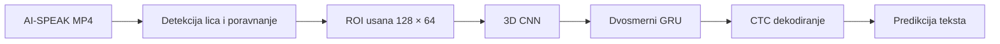

# Vizuelno prepoznavanje srpskog govora pomoću LipNet modela

Ovaj repozitorijum sadrži kompletan eksperimentalni pipeline za vizuelno
prepoznavanje srpskog govora: od izdvajanja regiona usana iz AI-SPEAK snimaka,
preko prilagođavanja i treniranja LipNet modela, do evaluacije tačnosti i
robustnosti. Projekat je realizovan u okviru predmeta **Mašinsko učenje 2**.

Osnova rešenja je [VIPL LipNet implementacija](https://github.com/VIPL-Audio-Visual-Speech-Understanding/LipNet-PyTorch),
prilagođena srpskom skupu karaktera, promenljivim dužinama video-sekvenci i
speaker-disjoint podeli AI-SPEAK korpusa.

## Rezultat rada

Finalni baseline je izabran prema validation WER-u i evaluiran jednom nad 540
test primera govornika koji nisu korišćeni za trening.

| Metrika | Validation skup | Test skup |
|---|---:|---:|
| WER | 49,72% | **45,25%** |
| CER | 22,02% | **18,24%** |
| Broj primera | 540 | 540 |

Eksperimenti robustnosti pokazuju da model zadržava sličan rezultat pri manjoj
rezoluciji, blagom zamućenju i malom pomeranju regiona usana:

| Uslov | WER | Promena WER-a |
|---|---:|---:|
| Baseline, 128 × 64 | **45,25%** | — |
| Rezolucija 96 × 48 | 45,77% | +0,52 p.p. |
| Rezolucija 64 × 32 | 45,90% | +0,65 p.p. |
| Gaussian blur | 45,96% | +0,71 p.p. |
| Pomeranje crop-a | 45,34% | +0,09 p.p. |

Mašinski čitljivi rezultati i tačna konfiguracija eksperimenta nalaze se u
folderu [`docs/results`](docs/results/README.md).

## Kako sistem radi



Model koristi tri 3D konvoluciona bloka za prostorno-vremenske karakteristike,
dva BiGRU sloja za modelovanje sekvence i CTC izlaz nad 29 klasa. Padding se
maskira kroz mrežu, a realne dužine sekvenci koriste se i u BiGRU slojevima i
pri dekodiranju.

## Struktura repozitorijuma

Svaki važan folder ima sopstveni README sa detaljima o sadržaju i načinu
korišćenja.

| Putanja | Sadržaj |
|---|---|
| [`lipnet/`](lipnet/README.md) | model, Dataset adapter, trening, dekoder i evaluacija |
| [`data/`](data/README.md) | verzionisana speaker-disjoint podela skupa |
| [`playground/`](playground/README.md) | reproduktivni Google Colab notebookovi, faze 0–7 |
| [`scripts/`](scripts/README.md) | preprocessing i generator notebookova |
| [`docs/`](docs/README.md) | metodologija, tehničke odluke i potvrđeni rezultati |
| [`tests/`](tests/README.md) | lokalni CPU testovi ključnih ugovora sistema |

## Reprodukcija eksperimenta

### 1. Lokalno okruženje

Preporučen je Python 3.12 i [uv](https://docs.astral.sh/uv/).

```powershell
git clone https://github.com/nikolabakic/Vizuelno-prepoznavanje-govora-na-osnovu-pokreta-usana-pomo-u-LipNet-modela.git
cd Vizuelno-prepoznavanje-govora-na-osnovu-pokreta-usana-pomo-u-LipNet-modela
uv sync --frozen --all-groups
uv run pytest -q
```

Lokalni testovi ne zahtevaju GPU niti pristup AI-SPEAK podacima.

### 2. Eksperimentalni pipeline

Notebookove iz foldera [`playground`](playground/README.md) treba pokretati
redosledom od `00` do `07`. Oni pokrivaju:

1. proveru izvornog VIPL modela i GRID inference-a;
2. pripremu AI-SPEAK snimaka i izdvajanje regiona usana;
3. srpski Dataset, vokabular i speaker-disjoint split;
4. transfer VIPL težina i proveru CTC treninga;
5. fine-tuning i izbor najboljeg checkpoint-a;
6. eksperimente robustnosti ulaza;
7. poređenje greedy i prefix beam CTC dekodiranja.

Notebookovi su generisani skriptom
[`scripts/build_phase_notebooks.py`](scripts/build_phase_notebooks.py). Izmene
se unose u generator, nakon čega se notebookovi ponovo generišu:

```powershell
uv run python scripts/build_phase_notebooks.py
```

## Podaci i artefakti

Veliki podaci, video-snimci, frejmovi usana i checkpoint-i čuvaju se van Git
repozitorijuma. Notebookovi očekuju sledeće podrazumevane Google Drive putanje:

```text
/content/drive/MyDrive/processed.zip
/content/drive/MyDrive/LipNet/ai_speak_lip.zip
/content/drive/MyDrive/LipNet/phase2_chunks_blazeface/
/content/drive/MyDrive/LipNet/phase5_length_aware_v2/
```

U repozitorijumu su verzionisani samo kod, notebookovi, dokumentacija i mali
sanitizovani JSON rezultati. Na taj način eksperiment ostaje proverljiv bez
objavljivanja privatnih ili identifikujućih podataka učesnika.

## Dodatna dokumentacija

- [Metodologija i eksperimentalni roadmap](docs/analiza-i-roadmap.md)
- [Potvrđeni rezultati i provera eksperimenta](docs/provera-rezultata.md)
- [Veza sa izvornom VIPL implementacijom](docs/upstream-diff.md)
- [Originalni tekst projektnog zadatka](36%20Vizuelno%20prepoznavanje%20govora%20na.txt)

Korišćena VIPL verzija je pinovana na commit
`40209e09c49553c00c25c7d41faa3706aea3c625`; pripadajuća licenca nalazi se u
[`lipnet/LICENSE.vipl`](lipnet/LICENSE.vipl).
